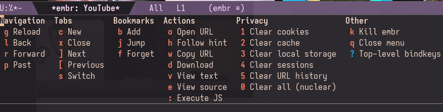

## embr.el
**Em**acs **Br**owser

Emacs is the display server. Headless Chromium via [CloakBrowser](https://cloakbrowser.dev) is the renderer. Frame transport uses CDP screencast. Emacs canvas (optional) is also supported for added performance. If you build Emacs with the [canvas patch](https://github.com/minad/emacs-canvas-patch) (see [./canvasmacs](./canvasmacs)), embr renders frames directly to a pixel buffer via a native C module.


## Prerequisites

- Python 3.10+
- Emacs 30.1+

## Installation

**Elpaca**

```elisp
(use-package embr
  :defer t
  :ensure (:host github
           :repo "emacs-os/embr.el"
           :files ("*.el" "*.py" "*.sh" "native/*.c" "native/Makefile"))
  :config
  (setq embr-hover-rate 30
        embr-default-width 1280
        embr-default-height 720
        embr-screen-width 1920
        embr-screen-height 1080
        embr-color-scheme 'dark
        embr-search-engine 'google
        embr-scroll-method 'instant
        embr-scroll-step 100
        embr-frame-source 'screencast
        embr-render-backend 'default
        embr-display-method 'headless))
```

**straight.el**

```elisp
(use-package embr
  :defer t
  :straight (:host github
             :repo "emacs-os/embr.el"
             :files ("*.el" "*.py" "*.sh" "native/*.c" "native/Makefile"))
  :config
  (setq embr-hover-rate 30
        embr-default-width 1280
        embr-default-height 720
        embr-screen-width 1920
        embr-screen-height 1080
        embr-color-scheme 'dark
        embr-search-engine 'google
        embr-scroll-method 'instant
        embr-scroll-step 100
        embr-frame-source 'screencast
        embr-render-backend 'default
        embr-display-method 'headless))
```

**Tip:** Of all the settings available, `embr-hover-rate` is the most mystifying. Higher values (e.g. 60) give lower-latency hover and can help with finicky buttons. Lower values (e.g. 20) reduce CDP traffic and may improve click reliability on slower machines. Setting this too high risks input lockups. Worth fiddling with.

**Tip:** Make embr your default Emacs browser and enable clickable URLs everywhere:

```elisp
(setq browse-url-browser-function 'embr-browse)
(global-goto-address-mode 1)
```

## Setup

After installing, run `M-x embr-setup-or-update-all` to create the Python venv and download CloakBrowser.

If you skip this step, `M-x embr-browse` will detect the missing venv and offer to run setup for you automatically.

### Management commands

All management is done from Emacs, no terminal needed.

| Command | Description |
|---------|-------------|
| `M-x embr-setup-or-update-all` | Install or update CloakBrowser + ad blocklist + uBlock Origin (runs `setup.sh --all`) |
| `M-x embr-update-blocklist` | Update the ad/tracker domain blocklist |
| `M-x embr-update-ublock` | Update uBlock Origin to the latest release |
| `M-x embr-install-or-update-darkreader` | Install or update [Dark Reader](https://github.com/darkreader/darkreader) to the latest release |
| `M-x embr-uninstall` | Remove venv and browser profile. Optionally delete browser cache (runs `uninstall.sh`). |
| `M-x embr-info` | Show diagnostic info about the installation |

The underlying `setup.sh` builds in a temp venv and swaps atomically, so it's always safe to re-run for both first install and updates.

### Where state is stored

| What | Path (0.40+) | Path (0.30) |
|------|--------------|-------------|
| Python venv | `~/.local/share/embr/.venv/` | same |
| Browser binary | `~/.cloakbrowser/` | `~/.cache/camoufox/` |
| Cookies & sessions | `~/.local/share/embr/chromium-profile/` | `~/.local/share/embr/firefox-profile/` |

`M-x embr-uninstall` removes the venv and profile. Browser cache deletion is offered as an optional prompt.

## Configuration

| Variable | Type | Default | Description |
|----------|------|---------|-------------|
| `embr-python` | file | `~/.local/share/embr/.venv/bin/python` | Path to Python interpreter in the embr venv. |
| `embr-script` | file | `embr.py` in package dir | Path to the embr.py daemon script. |
| `embr-hover-rate` | integer | `30` | Mouse hover tracking rate in Hz. Higher values (e.g. 60) give lower-latency hover and can help with finicky buttons. Lower values (e.g. 20) reduce CDP traffic and may improve click reliability on slower machines. Setting this too high risks input lockups. |
| `embr-default-width` | integer | `1280` | Viewport width in pixels |
| `embr-default-height` | integer | `720` | Viewport height in pixels |
| `embr-screen-width` | integer | `1920` | Screen width reported to websites (should be >= viewport) |
| `embr-screen-height` | integer | `1080` | Screen height reported to websites (should be >= viewport) |
| `embr-color-scheme` | symbol/nil | `'dark` | `'dark`, `'light`, or `nil` to let CloakBrowser choose. Controls `prefers-color-scheme`. |
| `embr-search-engine` | symbol/string/function | `'google` | `'google`, `'brave`, `'duckduckgo`, `'bing`, `'yandex`, `'baidu`, custom URL with `%s`, or a function taking one string argument (the query). Non-URL input is passed to the function instead of navigating the browser. |
| `embr-search-prefix` | string/nil | `nil` | String prepended to queries when `embr-search-engine` is a function |
| `embr-click-method` | symbol | `'immediate` | `'atomic` defers mousedown until drag detected, better iframe compat. `'immediate` sends mousedown instantly, for press-and-hold sites. |
| `embr-scroll-method` | symbol | `'instant` | `'instant` scrolls instantly. `'smooth` scrolls with CSS animation. |
| `embr-scroll-step` | integer | `100` | Scroll distance in pixels per wheel notch |
| `embr-dom-caret-hack` | boolean | `nil` | Inject a fake DOM caret in focused text fields. Only needed with screenshot transport. Screencast captures the native caret. |
| `embr-href-preview-hack` | boolean | `t` | Show hovered link URLs in a status bar overlay at the bottom of the page. |
| `embr-perf-log` | boolean | `nil` | Write JSONL perf events to `/tmp/embr-perf.jsonl`. Analyze with `tools/embr-perf-report.py`. |
| `embr-hover-move-threshold-px` | integer | `0` | Minimum pixel distance before sending a hover update. Filters sub-pixel jitter. |
| `embr-external-command` | string | `yt-dlp -o - %s \| mpv -` | Shell command for `&` key (`%s` = URL). |
| `embr-download-directory` | directory | `~/Downloads/` | Directory where downloaded files are saved. |
| `embr-frame-source` | symbol | `'screencast` | `'screencast` uses CDP screencast (recommended). `'screenshot` uses polling only. |
| `embr-render-backend` | symbol | `'default` | `'default` uses JPEG file + create-image. `'canvas` requires canvas-patched Emacs + native module. |
| `embr-display-method` | symbol | `'headless` | `'headless` (no window, no audio), `'headed` (visible window, audio), `'headed-offscreen` (hidden window via Xvfb, audio). |
| `embr-dispatch-key` | string | `"C-c"` | Key that opens the transient dispatch menu. Must be set before embr is loaded. |


## Usage

```
M-x embr-browse RET example.com RET
```

## Keybindings

All keys are forwarded directly to the browser. Typing, arrows, backspace, tab, and enter work as expected. `C-x`, `M-x`, etc. stay free for Emacs. Top-level keybindings translate familiar Emacs motion keys into browser equivalents (`C-c ?` to view them all).


### Browser commands

Pressing `C-c` opens a transient dispatch menu (like Magit). The prefix key is configurable via `embr-dispatch-key`, but the underlying keys follow eww conventions where possible and should be kept as-is. By learning embr keys, you learn eww keys too, so if eww is ever updated to handle the modern web, switching has no learning curve.



### Bookmarks

Standard Emacs bookmarks work. The dispatch menu (`C-c`) has shortcuts: `b` to add, `j` to jump, `f` to forget. The usual `C-x r m` and `C-x r b` also work.

## Ad Blocking

Two layers of ad blocking are available.

**Domain-level blocklist** (built in). The [StevenBlack/hosts](https://github.com/StevenBlack/hosts) list (~82K ad and tracker domains) intercepts and kills requests to blocked domains before they hit the network.

### uBlock Origin (optional)

For ad blocking beyond domain-level, you can install [uBlock Origin](https://github.com/gorhill/uBlock) as a Chromium extension. It is downloaded by `M-x embr-setup-or-update-all` but requires one-time manual setup in headed mode (headless Chromium does not support extensions).

1. **Install Xvfb** (if you don't have it, needed for `headed-offscreen` mode):

   ```sh
   # Arch
   sudo pacman -S xorg-server-xvfb
   # Debian/Ubuntu
   sudo apt install xvfb
   # Fedora
   sudo dnf install xorg-x11-server-Xvfb
   ```

2. **Switch to headed mode** so you can see the browser:

   ```elisp
   (setq embr-display-method 'headed)
   ```

3. **Enable the extension.** Navigate to `chrome://extensions`, turn on **Developer mode** (top-right toggle), and enable uBlock Origin if it is not already active.

4. **Switch to headed-offscreen** and restart embr. The extension persists in your browser profile across restarts.

   ```elisp
   (setq embr-display-method 'headed-offscreen)
   ```


### Dark Reader (optional)

[Dark Reader](https://github.com/darkreader/darkreader) forces dark mode on websites that don't support it natively. Not included in `M-x embr-setup-or-update-all`. To install:

1. Run `M-x embr-install-or-update-darkreader`.
2. Enable it the same way as uBlock above (headed mode, `chrome://extensions`, Developer mode, enable).
3. Switch back to `headed-offscreen` and restart. The extension persists in your profile.

To manage, disable, or remove it, switch to `'headed` mode and visit `chrome://extensions`.

## FAQ

### Why CloakBrowser?

Plain Playwright was fast but made the modern web nearly unusable. Corporate apps would immediately flag it as a bot and throw captchas. We switched to Camoufox (a hardened Firefox fork) and bot detection stopped, but it came with a significant performance cost. Camoufox masks timing signals across a large portion of the Firefox stack, which adds up.

CloakBrowser is a Chromium-based alternative that applies stealth via source-level C++ patches rather than JS overrides. The overhead is much lower. After switching, bot detection stayed gone and performance came back. That is why we use it.

### Does audio/video work?

Video playback works.

Audio playback works.

Mic, camera, and screen sharing do not work.

### Will you add vim-like modal keybindings (like Vimium)?

No plans to add this upstream, but PRs are welcome. If you implement it, gate it behind a `defcustom` (e.g. `embr-keymap-style` with `'default` and `'vimium` options) and make sure the default behavior is unchanged. Do not break existing keybindings.

### How do I search?

Any non-URL input in `C-c o` (Open URL) or passed as a string argument to `embr-browse` is treated as a search query. The default engine is Google. Set `embr-search-engine` to `'google`, `'brave`, `'duckduckgo`, `'bing`, `'yandex`, `'baidu`, or a custom URL string with `%s` for the query (e.g. `"https://search.brave.com/search?q=%s"`).

### How do I use an AI agent instead of a search engine?

Set `embr-search-engine` to a function that accepts a single string argument. Any non-URL input from the navigate prompt (`C-c o` or `embr-browse`) goes to your function instead of the browser.

```elisp
(setq embr-search-engine #'my-llm-search-function
      embr-search-prefix "You're my google. Provide best results: ")
```

The function receives the query (with prefix prepended if set) as its only argument. This works with any agent buffer or LLM interface as long as your function takes a string. How you handle the query is up to you.

To make links in the AI response open back in embr, completing the loop:

```elisp
(setq browse-url-browser-function 'embr-browse)
(global-goto-address-mode 1)
```

### How do I download files?

Clicking a downloadable link (e.g. a .zip or .tar.gz) does nothing. Unsolicited downloads are actively cancelled. Headless browsers are used for automation, and silently writing files to disk without explicit user action would be a security risk. embr only downloads when you ask it to.

Use `C-c d` to download. Hover over a link so the status bar shows the URL, then press `C-c d`. The URL appears in the minibuffer for confirmation. Press RET and the file saves to `embr-download-directory` (defaults to `~/Downloads/`). If your mouse is not over a link, hint labels appear so you can pick one.

Downloads go through Chromium's network stack, so session cookies and authentication are preserved. Protected/login-gated downloads work the same as in a normal browser.

### How does incognito mode work?

`M-x embr-browse-incognito` launches a separate embr daemon with a fresh throwaway Chromium profile in a temp directory. No cookies, no history, no local storage carry over from your normal session. On quit, the temp profile is deleted with `shutil.rmtree()`.

You might notice if you use `'headed` mode that this is not Chromium's `--incognito` flag. It is a disposable profile at the filesystem level. The privacy properties are the same (fresh state, destroyed on exit), but extensions like uBlock Origin still work, and you get stronger cleanup guarantees since we control the directory deletion. The missing incognito badge is cosmetic and does not affect the isolation.

### Does this work on macOS?

Unknown. Let us know.

### Windows?

No.

### Can I install other Chromium extensions?

Yes. Switch to `'headed` mode, navigate to `chrome://extensions`, enable Developer mode, and install the extension manually (drag a `.crx` or load unpacked). Extensions persist in your browser profile at `~/.local/share/embr/chromium-profile/`. Switch back to `'headed-offscreen` when done.

Chromium extensions do not auto-update in embr. See how `setup.sh` keeps uBlock and Dark Reader current via the GitHub releases API, and consider a similar approach for any extensions you add.

### Why not just use EXWM?

EXWM is X11 only. There is also an experimental Wayland equivalent in the same spirit. embr takes a different approach: it does not turn Emacs into a window manager and works on any desktop environment, Wayland or Xorg. That said, this is just another option. Use whatever works for you.
