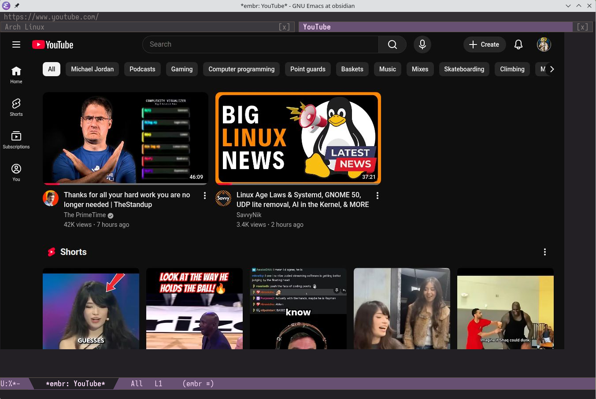

## embr.el
**Em**acs **Br**owser

> **2026-03-20:** Starting in 0.40, embr has migrated from Camoufox/Firefox to [CloakBrowser](https://cloakbrowser.dev)/Chromium. Thanks to [this helpful suggestion](https://www.reddit.com/r/emacs/comments/1ry1q5q/comment/obkg39k/) for pointing us in the right direction. The new engine brings better performance and native CDP support. See HOW_TO_UPDATE.md.

Emacs is the display server. Headless Chromium via [CloakBrowser](https://cloakbrowser.dev) is the renderer. Frame transport uses CDP screencast by default, with automatic fallback to screenshot polling. On the Emacs side, if you build Emacs with the [canvas patch](https://github.com/minad/emacs-canvas-patch) (see `./canvasmacs`), embr renders frames directly to a pixel buffer via a native C module, skipping the per-frame disk round-trip.



## Prerequisites

- Python 3.10+
- Emacs 30.1+

## Installation

**Elpaca**

```elisp
(use-package embr
  :defer t
  :ensure (:host github
           :repo "emacs-os/embr.el"
           :files ("*.el" "*.py" "*.sh" "native/*.c" "native/Makefile"))
  :config
  (setq embr-hover-rate 30
        embr-default-width 1280
        embr-default-height 720
        embr-screen-width 1920
        embr-screen-height 1080
        embr-color-scheme 'dark
        embr-search-engine 'google
        embr-scroll-method 'instant
        embr-scroll-step 100
        embr-frame-source 'screencast
        embr-render-backend 'auto
        embr-display-method 'headless))
```

**straight.el**

```elisp
(use-package embr
  :defer t
  :straight (:host github
             :repo "emacs-os/embr.el"
             :files ("*.el" "*.py" "*.sh" "native/*.c" "native/Makefile"))
  :config
  (setq embr-hover-rate 30
        embr-default-width 1280
        embr-default-height 720
        embr-screen-width 1920
        embr-screen-height 1080
        embr-color-scheme 'dark
        embr-search-engine 'google
        embr-scroll-method 'instant
        embr-scroll-step 100
        embr-frame-source 'screencast
        embr-render-backend 'auto
        embr-display-method 'headless))
```

**Tip:** Make embr your default Emacs browser and enable clickable URLs everywhere:

```elisp
(setq browse-url-browser-function 'embr-browse)
(global-goto-address-mode 1)
```

## Setup

After installing, run `M-x embr-setup-or-update-all` to create the Python venv and download CloakBrowser.

If you skip this step, `M-x embr-browse` will detect the missing venv and offer to run setup for you automatically.

### Management commands

All management is done from Emacs, no terminal needed.

| Command | Description |
|---------|-------------|
| `M-x embr-setup-or-update-all` | Install or update CloakBrowser + ad blocklist + uBlock Origin (runs `setup.sh --all`) |
| `M-x embr-update-blocklist` | Update the ad/tracker domain blocklist |
| `M-x embr-update-ublock` | Update uBlock Origin to the latest release |
| `M-x embr-uninstall` | Remove venv and browser profile. Optionally delete browser cache (runs `uninstall.sh`). |
| `M-x embr-info` | Show diagnostic info about the installation |

The underlying `setup.sh` builds in a temp venv and swaps atomically, so it's always safe to re-run for both first install and updates.

### Where state is stored

| What | Path (0.40+) | Path (0.30) |
|------|--------------|-------------|
| Python venv | `~/.local/share/embr/.venv/` | same |
| Browser binary | `~/.cache/cloakbrowser/` | `~/.cache/camoufox/` |
| Cookies & sessions | `~/.local/share/embr/chromium-profile/` | `~/.local/share/embr/firefox-profile/` |

`M-x embr-uninstall` removes the venv and profile. Browser cache deletion is offered as an optional prompt.

## Configuration

| Variable | Type | Default | Description |
|----------|------|---------|-------------|
| `embr-python` | file | `~/.local/share/embr/.venv/bin/python` | Path to Python interpreter in the embr venv. |
| `embr-script` | file | `embr.py` in package dir | Path to the embr.py daemon script. |
| `embr-hover-rate` | integer | `30` | Mouse hover tracking rate in Hz. |
| `embr-default-width` | integer | `1280` | Viewport width in pixels |
| `embr-default-height` | integer | `720` | Viewport height in pixels |
| `embr-screen-width` | integer | `1920` | Screen width reported to websites (should be >= viewport) |
| `embr-screen-height` | integer | `1080` | Screen height reported to websites (should be >= viewport) |
| `embr-color-scheme` | symbol/nil | `'dark` | `'dark`, `'light`, or `nil` to let CloakBrowser choose. Controls `prefers-color-scheme`. |
| `embr-search-engine` | symbol/string | `'google` | `'google`, `'brave`, `'duckduckgo`, or custom URL with `%s` |
| `embr-click-method` | symbol | `'immediate` | `'atomic` defers mousedown until drag detected, better iframe compat. `'immediate` sends mousedown instantly, for press-and-hold sites. |
| `embr-scroll-method` | symbol | `'instant` | `'instant` scrolls instantly. `'smooth` scrolls with CSS animation. |
| `embr-scroll-step` | integer | `100` | Scroll distance in pixels per wheel notch |
| `embr-dom-caret-hack` | boolean | `t` | Inject a fake DOM caret in focused text fields. CDP screenshots don't capture the native caret. |
| `embr-perf-log` | boolean | `nil` | Write JSONL perf events to `/tmp/embr-perf.jsonl`. Analyze with `tools/embr-perf-report.py`. |
| `embr-hover-move-threshold-px` | integer | `0` | Minimum pixel distance before sending a hover update. Filters sub-pixel jitter. |
| `embr-external-command` | string | yt-dlp + mpv | Shell command for `&` key (`%s` = URL). Default pipes through yt-dlp into mpv. |
| `embr-frame-source` | symbol | `'screencast` | `'screencast` uses CDP screencast (recommended). `'auto` tries screencast first, falls back to polling. `'screenshot` uses polling only. |
| `embr-render-backend` | symbol | `'auto` | `'auto` uses canvas if available, falls back to legacy. `'legacy` uses JPEG file + create-image. `'canvas` requires canvas-patched Emacs + native module. |
| `embr-display-method` | symbol | `'headless` | `'headless` (no window, no audio), `'headed` (visible window, audio), `'headed-offscreen` (hidden window via Xvfb, audio). |


## Usage

```
M-x embr-browse RET example.com RET
```

## Keybindings

All keys are forwarded directly to the browser. Typing, arrows, backspace, tab, and enter work as expected. `C-x`, `M-x`, etc. stay free for Emacs.

The top-level keybindings below translate familiar Emacs motion keys into their browser equivalents. If you're familiar with EXWM, same concept as simulation keys.

| Key | Action |
|-----|--------|
| `C-l` | Go to URL or search (with history completion) |
| `C-b` | Left arrow |
| `C-f` | Right arrow |
| `C-n` | Down arrow |
| `C-p` | Up arrow |
| `C-a` | Home |
| `C-e` | End |
| `C-d` | Delete forward |
| `M-f` | Word forward |
| `M-b` | Word backward |
| `M-w` | Copy browser selection to kill ring (system clipboard) |
| `C-y` | Paste from kill ring into browser |
| `C-s` | Search forward (isearch-style) |
| `C-r` | Search backward (isearch-style) |
| `C-v` | Page down |
| `M-v` | Page up |
| `&` | Run `embr-external-command` on current URL (default: yt-dlp + mpv) |
| `F5` | Refresh page |
| `C-x` | Emacs prefix (not forwarded) |
| `M-x` | Emacs command (not forwarded) |
| `C-c` | Browser command prefix (see below) |

### Browser commands

Browser commands use the `C-c` prefix. Eww-inspired commands, just behind a prefix instead of on top-level keys. This gives a more natural browser typing experience while keeping power tools a combo away.

| Key | Action |
|-----|--------|
| `C-c l` | Go to URL or search (same as `C-l`) |
| `C-c h` | Follow link (Vimium-style hint labels) |
| `C-c r` | Refresh |
| `C-c b` / `C-c C-b` | Back |
| `C-c f` / `C-c C-f` | Forward |
| `C-c t` | View page text in a separate buffer |
| `C-c w` | Copy current URL to kill ring |
| `C-c :` | Execute JavaScript |
| `C-c q` | Quit (kills daemon and buffer) |
| `C-c n` | Open new tab |
| `C-c d` | Close current tab |
| `C-c ]` / `C-c [` | Next / previous tab |
| `C-c a` | List all tabs |
| Mouse click | Click at coordinates |
| Click and drag | Select text |
| Scroll wheel | Scroll page |

### Bookmarks

Standard Emacs bookmarks work: `C-x r m` to save, `C-x r b` to jump.

## Ad Blocking

A **domain-level blocklist** using the [StevenBlack/hosts](https://github.com/StevenBlack/hosts) list (~82K ad and tracker domains) is included out of the box. Requests to blocked domains are intercepted and killed before they hit the network. The blocklist is downloaded by `setup.sh` and refreshed alongside the CloakBrowser binary every time you run `M-x embr-setup-or-update-all`. Run it periodically to keep both up to date.

### uBlock Origin (optional)

For full cosmetic filtering, element hiding, and script-level ad blocking (e.g. YouTube ads), you can install [uBlock Origin](https://github.com/gorhill/uBlock) as a Chromium extension. Headless Chromium does not support extensions, so this requires a one-time setup in headed mode. `M-x embr-setup-or-update-all` downloads the latest uBlock Origin release for you. You just need to enable it once.

1. **Install Xvfb** (if you don't have it, needed for `headed-offscreen` mode):

   ```sh
   # Arch
   sudo pacman -S xorg-server-xvfb
   # Debian/Ubuntu
   sudo apt install xvfb
   # Fedora
   sudo dnf install xorg-x11-server-Xvfb
   ```

2. **Switch to headed mode** so you can see the browser:

   ```elisp
   (setq embr-display-method 'headed)
   ```

3. **Enable the extension.** Navigate to `chrome://extensions`, turn on **Developer mode** (top-right toggle), and enable uBlock Origin if it is not already active.

4. **Switch to headed-offscreen** and restart embr. The extension persists in your browser profile across restarts.

   ```elisp
   (setq embr-display-method 'headed-offscreen)
   ```

## Emacs Canvas

If you built a recent Emacs with the experimental [canvas patches](https://github.com/minad/emacs-canvas-patch), embr will detect it at startup and use a native canvas render path (JPEG decode straight to pixel buffer, no disk round-trip). Runs great without it too. Arch users can check `./canvasmacs` for a PKGBUILD that builds `emacs-wayland` with the canvas patches applied.

## FAQ

### Does audio/video work?

**Video playback works.**

**Audio playback works.** Headless Chromium routes audio through PulseAudio/PipeWire.

**Mic, camera, and screen sharing do not work.**

### Will you add vim-like modal keybindings (like Vimium)?

No plans to add this upstream, but PRs are welcome. If you implement it, gate it behind a `defcustom` (e.g. `embr-keymap-style` with `'default` and `'modal` options) and make sure the default behavior is unchanged. Do not break existing keybindings.

### Does this work on macOS?

Unknown. Let us know.

### Windows?

No.
