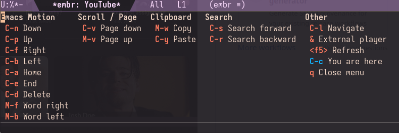
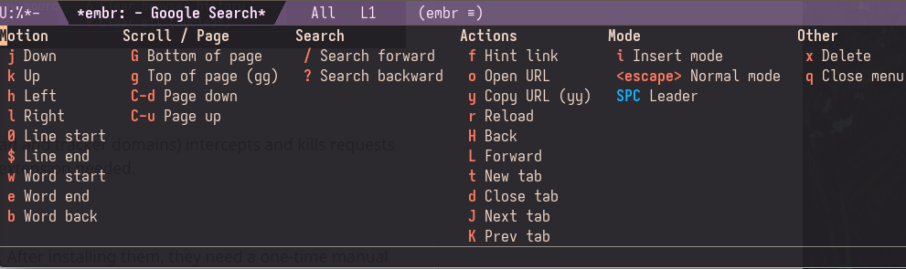

## embr.el
**Em**acs **Br**owser

Emacs is the display server. Headless Chromium via [CloakBrowser](https://cloakbrowser.dev) is the renderer. Frame transport uses CDP screencast. Emacs simulation keys pass through to the browser (similar to EXWM), and an optional `embr-vimium-mode` provides modal navigation for evil-mode users. Emacs canvas (optional) is also supported for added performance. If you build Emacs with the [canvas patch](https://github.com/minad/emacs-canvas-patch) (see [./canvasmacs](./canvasmacs)), embr renders frames directly to a pixel buffer via a native C module.


## Prerequisites

- Python 3.10+
- Emacs 30.1+

## Installation

**Elpaca**

```elisp
(use-package embr
  :defer t
  :ensure (:host github
           :repo "emacs-os/embr.el"
           :files ("*.el" "*.py" "*.sh" "native/*.c" "native/Makefile"))
  ;; :hook (embr-mode . embr-vimium-mode)
  :config
  (setq embr-hover-rate 30
        embr-default-width 1280
        embr-default-height 720
        embr-screen-width 1920
        embr-screen-height 1080
        embr-color-scheme 'dark
        embr-search-engine 'google
        embr-scroll-method 'instant
        embr-scroll-step 100
        embr-frame-source 'screencast
        embr-render-backend 'default
        embr-display-method 'headless
        embr-home-url "about:blank"
        embr-session-restore t
        embr-tab-bar t
        embr-proxy-rules nil))
```

**straight.el**

```elisp
(use-package embr
  :defer t
  :straight (:host github
             :repo "emacs-os/embr.el"
             :files ("*.el" "*.py" "*.sh" "native/*.c" "native/Makefile"))
  ;; :hook (embr-mode . embr-vimium-mode)
  :config
  (setq embr-hover-rate 30
        embr-default-width 1280
        embr-default-height 720
        embr-screen-width 1920
        embr-screen-height 1080
        embr-color-scheme 'dark
        embr-search-engine 'google
        embr-scroll-method 'instant
        embr-scroll-step 100
        embr-frame-source 'screencast
        embr-render-backend 'default
        embr-display-method 'headless
        embr-home-url "about:blank"
        embr-session-restore t
        embr-tab-bar t
        embr-proxy-rules nil))
```

**Tip:** Make embr your default Emacs browser and enable clickable URLs everywhere:

```elisp
(setq browse-url-browser-function 'embr-browse)
(global-goto-address-mode 1)
```

**Tip:** A wider frame fits the browser better than the default Emacs dimensions:

```elisp
(set-frame-size nil 150 40)
```

**For the fully converted (lol):** If you add `(unless (server-running-p) (server-start))` to your init.el and drop this script in e.g. `/usr/local/bin/chromium`:

```sh
#!/bin/sh
if emacsclient --eval "t" >/dev/null 2>&1; then
    emacsclient --eval "(embr-browse \"$@\")"
else
    emacs --eval "(embr-browse \"$@\")" &
fi
```

then any CLI call like `chromium example.com` goes straight to embr, in your existing Emacs frame if it's running, or a fresh one if it's not. To make it the system default browser (so KDE, GNOME, xdg-open, etc. use it), save this as `~/.local/share/applications/chromium.desktop`:

```ini
[Desktop Entry]
Name=chromium
Exec=/usr/local/bin/chromium %u
Type=Application
MimeType=x-scheme-handler/http;x-scheme-handler/https;
```

Then uninstall your system Chromium and set this one as default. Probably not recommended, but it could be fun.

## Setup

After installing, run `M-x embr-install-or-update-cloakbrowser` to create the Python venv and download CloakBrowser. This is the only required step. If you skip it, `M-x embr-browse` will offer to run it for you.

Everything else is optional. The blocklist, uBlock Origin, and Dark Reader are independent add-ons. Each has its own install and remove command. You pick what you want. Extensions need a [one-time enable in headed mode](#enabling-extensions-in-headed-mode) after installing.

| Command | What it does |
|---------|-------------|
| `M-x embr-install-or-update-cloakbrowser` | Install or update Python venv + CloakBrowser binary (required) |
| `M-x embr-install-or-update-blocklist` | Install or update the [StevenBlack/hosts](https://github.com/StevenBlack/hosts) domain blocklist |
| `M-x embr-install-or-update-ublock` | Install or update [uBlock Origin](https://github.com/gorhill/uBlock) |
| `M-x embr-install-or-update-darkreader` | Install or update [Dark Reader](https://github.com/darkreader/darkreader) |
| `M-x embr-remove-blocklist` | Remove the domain blocklist |
| `M-x embr-remove-ublock` | Remove uBlock Origin |
| `M-x embr-remove-darkreader` | Remove Dark Reader |
| `M-x embr-uninstall` | Remove everything (`~/.local/share/embr/` and `~/.cloakbrowser/`) |
| `M-x embr-info` | Show what is installed |

All management is done from Emacs, no terminal needed. `setup.sh` builds in a temp venv and swaps atomically, so install and update are the same operation.

### Where state is stored

| What | Path (0.40+) | Path (0.30) |
|------|--------------|-------------|
| Python venv | `~/.local/share/embr/.venv/` | same |
| Browser binary | `~/.cloakbrowser/` | `~/.cache/camoufox/` |
| Cookies & sessions | `~/.local/share/embr/chromium-profile/` | `~/.local/share/embr/firefox-profile/` |

## Configuration

| Variable | Type | Default | Description |
|----------|------|---------|-------------|
| `embr-hover-rate` | integer | `30` | Mouse hover tracking rate in Hz. Higher values (e.g. 60) give lower-latency hover and can help with finicky buttons. Lower values (e.g. 20) reduce CDP traffic and may improve click reliability on slower machines. Setting this too high risks input lockups. Recommend 30 for `'default` backend, 60 for `'canvas`. |
| `embr-default-width` | integer | `1280` | Viewport width in pixels |
| `embr-default-height` | integer | `720` | Viewport height in pixels |
| `embr-screen-width` | integer | `1920` | Screen width reported to websites (should be >= viewport) |
| `embr-screen-height` | integer | `1080` | Screen height reported to websites (should be >= viewport) |
| `embr-color-scheme` | symbol/nil | `'dark` | `'dark`, `'light`, or `nil` to let CloakBrowser choose. Controls `prefers-color-scheme`. |
| `embr-search-engine` | symbol/string/function | `'google` | `'google`, `'brave`, `'duckduckgo`, `'bing`, `'yandex`, `'baidu`, custom URL with `%s`, or a function taking one string argument (the query). Non-URL input is passed to the function instead of navigating the browser. |
| `embr-search-prefix` | string/nil | `nil` | String prepended to queries when `embr-search-engine` is a function |
| `embr-click-method` | symbol | `'immediate` | `'atomic` defers mousedown until drag detected, better iframe compat. `'immediate` sends mousedown instantly, for press-and-hold sites. |
| `embr-scroll-method` | symbol | `'instant` | `'instant` scrolls instantly. `'smooth` scrolls with CSS animation. |
| `embr-scroll-step` | integer | `100` | Scroll distance in pixels per wheel notch |
| `embr-dom-caret-hack` | boolean | `nil` | Inject a fake DOM caret in focused text fields. Only needed with screenshot transport. Screencast captures the native caret. |
| `embr-href-preview-hack` | boolean | `t` | Show hovered link URLs in a status bar overlay at the bottom of the page. |
| `embr-perf-log` | boolean | `nil` | Write JSONL perf events to `/tmp/embr-perf.jsonl`. Analyze with `tools/embr-perf-report.py`. |
| `embr-hover-move-threshold-px` | integer | `0` | Minimum pixel distance before sending a hover update. Filters sub-pixel jitter. |
| `embr-external-command` | string | `yt-dlp -o - %s \| mpv -` | Shell command for `&` key (`%s` = URL). |
| `embr-download-directory` | directory | `~/Downloads/` | Directory where downloaded files are saved. |
| `embr-jpeg-quality` | integer | `80` | JPEG quality (1-100) for frame captures. Used by both screencast and screenshot. Lower values encode faster but degrade image quality. |
| `embr-frame-source` | symbol | `'screencast` | `'screencast` uses CDP screencast (recommended). `'screenshot` uses polling only. |
| `embr-render-backend` | symbol | `'default` | `'default` uses JPEG file + create-image. `'canvas` requires canvas-patched Emacs. |
| `embr-display-method` | symbol | `'headless` | `'headless`, `'headed` (requires Xvfb), `'headed-offscreen` (requires Xvfb). |
| `embr-dispatch-key` | string | `"C-c"` | Key that opens the transient dispatch menu. Must be set before embr is loaded. |
| `embr-vimium-leader` | string | `"SPC"` | Key that opens the dispatch menu in vimium normal mode. |
| `embr-vimium-start-in-normal` | boolean | `t` | Start in normal mode when `embr-vimium-mode` is enabled. |
| `embr-tab-bar` | boolean | `nil` | Non-nil means show a clickable tab bar above the page. Click to switch, click "x" to close. |
| `embr-home-url` | string | `"about:blank"` | URL to navigate to when embr is launched interactively. |
| `embr-session-restore` | boolean | `nil` | Non-nil means save and restore open tabs across sessions. |
| `embr-proxy-rules` | list/nil | `nil` | Per-domain proxy routing. Each entry is `(SUFFIX TYPE ADDRESS)`. `.onion` through Tor, `.i2p` through I2P, `*` as catch-all. Generates a PAC file for Chromium. Header line shows a red "PROXY" badge when set. |


## Usage

```
M-x embr-browse RET example.com RET
```

## Keybindings

All keys are forwarded directly to the browser. Typing, arrows, backspace, tab, and enter work as expected. `C-x`, `M-x`, etc. stay free for Emacs. Top-level keybindings translate familiar Emacs motion keys into browser equivalents (`C-c ?` to view them all). For vim-style modal navigation, enable `embr-vimium-mode`.



With `embr-vimium-mode` enabled, `SPC ?` shows the vim-style bindings:



### Browser commands

Pressing `C-c` or `SPC` (`embr-vimium-mode`) opens a transient dispatch menu (like Magit). The prefix key is configurable via `embr-dispatch-key`. The vimium leader key is configurable via `embr-vimium-leader`.


## Ad Blocking

**Domain-level blocklist.** The StevenBlack/hosts list (~82K ad and tracker domains) intercepts and kills requests before they hit the network. Works in headless mode, no extension needed.

### Enabling extensions in headed mode

uBlock Origin and Dark Reader are Chromium extensions. After installing them, they need a one-time manual enable in headed mode (headless Chromium does not show extension UI). Headed mode requires Xvfb (`pacman -S xorg-server-xvfb`).

1. **Switch to headed mode** so you can see the browser:

   ```elisp
   (setq embr-display-method 'headed)
   ```

2. **Enable the extension.** Navigate to `chrome://extensions`, turn on **Developer mode** (top-right toggle), and enable the extension.

3. **Switch back to headless** and restart embr. Extensions persist in your browser profile across restarts.

   ```elisp
   (setq embr-display-method 'headless)
   ```


To disable an extension temporarily, switch to `'headed` mode and visit `chrome://extensions`.

## Password Manager


`embr-passwd.el` is a local password manager. GPG-encrypted vault, pwgen for generation.

### Setup

1. [Generate a GPG key](https://docs.github.com/en/authentication/managing-commit-signature-verification/generating-a-new-gpg-key) if you do not have one. Give it ultimate trust: `gpg --edit-key KEYID trust` (select 5).
2. Find your key ID with `gpg --list-keys --keyid-format short`. Use the short ID after `pub` (e.g. `A05696CC`) or the full fingerprint. Set it and run init:

```elisp
(setq embr-passwd-encrypt-to "YOUR_GPG_KEY_ID")
```

3. `M-x embr-passwd-init` creates an empty vault at `embr-passwd-file` (defaults to `~/Documents/passwd.json.gpg`).

### Workflow

Need to register on a site? Run `M-x embr-passwd-add` first. Enter the site name, username and/or email, and leave the password blank to auto-generate one. Then `M-x embr-passwd-inject` to interactively fill the signup form: pick the entry you just created, focus each field, press `C-j` to fill it. All embr navigation works while selecting fields (click, tab, `C-c f` hints).

`M-x embr-passwd-generate` is also available standalone if you just need a password on the clipboard.

### Commands

| Command | Description |
|---------|-------------|
| `embr-passwd-init` | Create empty vault |
| `embr-passwd-add` | Add site/username/email/password/notes (fields optional except site and password; empty password generates one) |
| `embr-passwd-remove` | Remove entry by site |
| `embr-passwd-get` | Copy password for a site to kill ring |
| `embr-passwd-generate` | Generate a password and copy to kill ring |
| `embr-passwd-inject` | Fill login/password fields on the current page |

### Configuration

| Variable | Default | Description |
|----------|---------|-------------|
| `embr-passwd-encrypt-to` | nil | GPG key ID (required) |
| `embr-passwd-file` | `~/Documents/passwd.json.gpg` | Vault file location |
| `embr-passwd-length` | 12 | Generated password length |
| `embr-passwd-pwgen-args` | `"-ycn"` | Arguments passed to pwgen |

Requires `pwgen` for password generation.

## FAQ

### Why CloakBrowser?

Plain Playwright was fast but made the modern web nearly unusable. Corporate apps would immediately flag it as a bot and throw captchas. We switched to Camoufox (a hardened Firefox fork) and bot detection stopped, but it came with a significant performance cost. Camoufox masks timing signals across a large portion of the Firefox stack, which adds up.

CloakBrowser is a Chromium-based alternative that applies stealth via source-level C++ patches rather than JS overrides. The overhead is much lower. After switching, bot detection stayed gone and performance came back. That is why we use it.

### Does audio/video work?

Video playback works.

Audio playback works.

PDF viewing works.

Mic, camera, and screen sharing do not work.

### How do I search?

Any non-URL input in `C-c o` (Open URL) or passed as a string argument to `embr-browse` is treated as a search query. The default engine is Google. Set `embr-search-engine` to `'google`, `'brave`, `'duckduckgo`, `'bing`, `'yandex`, `'baidu`, or a custom URL string with `%s` for the query (e.g. `"https://search.brave.com/search?q=%s"`).

### How do I use an AI agent instead of a search engine?

Set `embr-search-engine` to a function that accepts a single string argument. Any non-URL input from the navigate prompt (`C-c o` or `embr-browse`) goes to your function instead of the browser.

```elisp
(setq embr-search-engine #'my-llm-search-function
      embr-search-prefix "You're my google. Provide best results: ")
```

The function receives the query (with prefix prepended if set) as its only argument. This works with any agent buffer or LLM interface as long as your function takes a string. How you handle the query is up to you. If you set `browse-url-browser-function` to `'embr-browse` (see Installation tip above), links in the AI response open back in embr, completing the loop.

### How do I download files?

Clicking a downloadable link (e.g. a .zip or .tar.gz) does nothing. Unsolicited downloads are actively cancelled. Headless browsers are used for automation, and silently writing files to disk without explicit user action would be a security risk. embr only downloads when you ask it to.

Use `C-c d` to download. Hover over a link so the status bar shows the URL, then press `C-c d`. The URL appears in the minibuffer for confirmation. Press RET and the file saves to `embr-download-directory` (defaults to `~/Downloads/`). If your mouse is not over a link, hint labels appear so you can pick one. `C-c D` skips all that and lets you type a URL directly.

Downloads go through Chromium's network stack, so session cookies and authentication are preserved. Protected/login-gated downloads work the same as in a normal browser.

Files save with the correct name on disk (e.g. `archlinux-2026.03.01-x86_64.iso`), but `chrome://downloads` may show a UUID instead (e.g. `74c99e0d-e367-439d-8425-9c6926a20cf9`). This is a Chromium quirk with how embr triggers downloads internally. The file on disk is correct.

### How does incognito mode work?

`M-x embr-browse-incognito` launches a separate embr daemon with a fresh throwaway Chromium profile in a temp directory. No cookies, no history, no local storage carry over from your normal session. On quit, the temp profile is deleted with `shutil.rmtree()`.

You might notice if you use `'headed` mode that this is not Chromium's `--incognito` flag. It is a disposable profile at the filesystem level. The privacy properties are the same (fresh state, destroyed on exit), but extensions like uBlock Origin still work, and you get stronger cleanup guarantees since we control the directory deletion. The missing incognito badge is cosmetic and does not affect the isolation.

### Can I run multiple sessions?

One normal session and one incognito session, simultaneously. Use browser tabs (`C-c c` to open, `C-c ]`/`[` to switch) for multiple pages within a session.

### How do I browse through Tor / I2P?

`embr-proxy-rules` routes domains through different proxies. Unmatched domains go direct.

```elisp
(setq embr-proxy-rules
      '((".onion" socks5 "127.0.0.1:9050") ; route .onion through Tor
        (".i2p"   http   "127.0.0.1:4444") ; route .i2p through I2P
        ;; ("*"      socks5 "127.0.0.1:9050") ; uncomment to send everything through Tor
        ))
```

Requires [Tor](https://wiki.archlinux.org/title/Tor) and/or [i2pd](https://wiki.archlinux.org/title/I2pd) running locally. The header line shows a red "PROXY" badge when routing through a proxy rule.

### Where are the scroll bars?

Headless Chromium does not render scroll bars. Setting `embr-display-method` to `'headed-offscreen` brings them back (requires Xvfb).

### Does this work on macOS?

Unknown. Let us know.

### Windows?

No.

### Can I install other Chromium extensions?

The Chrome Web Store does not work with CloakBrowser. Instead, switch to `'headed` mode, navigate to `chrome://extensions`, enable Developer mode, and install the extension manually (drag a `.crx` or load unpacked). Extensions persist in your browser profile at `~/.local/share/embr/chromium-profile/`. Switch back to `'headless` when done.

Chromium extensions do not auto-update in CloakBrowser. See how `setup.sh` keeps uBlock and Dark Reader current via the GitHub releases API, and consider a similar approach for any extensions you may add.

### Why not just use EXWM?

EXWM is X11 only. There is also an experimental Wayland equivalent in the same spirit. embr takes a different approach: it does not turn Emacs into a window manager and works on any desktop environment, Wayland or Xorg. That said, this is just another option. Use whatever works for you.

### Credits

Screenshots use [moody](https://github.com/tarsius/moody) for the mode line, [Aporetic Sans Mono](https://github.com/protesilaos/aporetic) for the font, and the [ef-dream](https://github.com/protesilaos/ef-themes) theme.

This project was built with [Codex 5.3 Very High](https://openai.com/codex) and [Claude Opus 4.6 High Effort](https://claude.ai/code).
